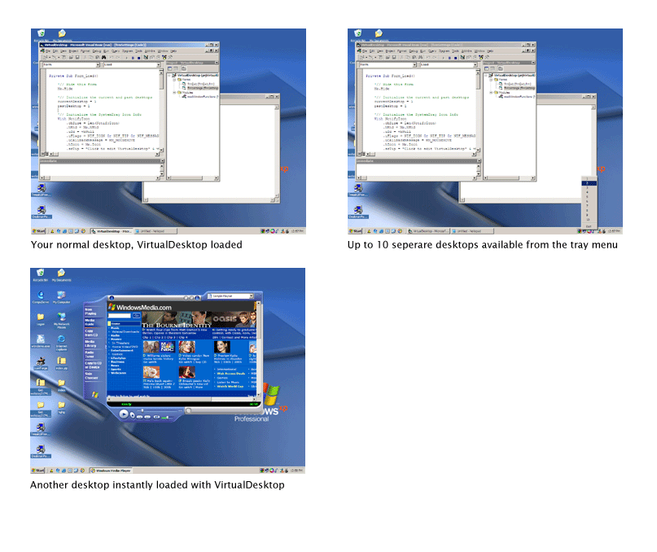



## Virtual Multiple Desktops in Windows

### Description

Do you have so many programs running at once that you go crazy trying to keep at least a little organized? Do you want to be able to manage multiple desktops like you can on Linux/Gnome-based interfaces? VirtualDesktop is the exact answer to this problem. This simple yet powerful utility will alow you to have up to 10 'virtual' desktops running on your system. It does this by scanning for valid windows (ignores tasks) and manages them with API calls. This code is well commented and not very large. I hope you like the utility and please comment to help me improve it. Please vote. Thanks.
 
### More Info
 
See Code

             |
---                |---
**Submitted On**   |2002-06-13 14:08:26
**By**             |[Matt Crowley](https://github.com/Planet-Source-Code/PSCIndex/blob/master/ByAuthor/matt-crowley.md)
**Level**          |Intermediate
**User Rating**    |4.9 (89 globes from 18 users)
**Compatibility**  |VB 4\.0 \(32\-bit\), VB 5\.0, VB 6\.0
**Category**       |[Complete Applications](https://github.com/Planet-Source-Code/PSCIndex/blob/master/ByCategory/complete-applications__1-27.md)
**World**          |[Visual Basic](https://github.com/Planet-Source-Code/PSCIndex/blob/master/ByWorld/visual-basic.md)
**Archive File**   |[Virtual\_Mu940276132002\.zip](https://github.com/Planet-Source-Code/matt-crowley-virtual-multiple-desktops-in-windows__1-35802/archive/master.zip)

### API Declarations

See Code

